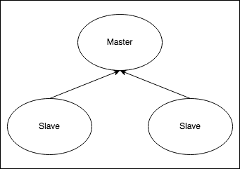
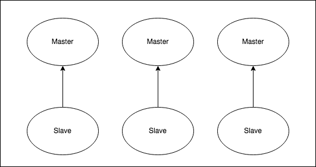

# Using Helm

Add the Bitnami repository to Helm
```shell
helm repo add bitnami https://charts.bitnami.com/bitnami
```
Looking for a specific chart
```shell
helm search repo bitnami/redis-cluster --versions
```
Download the chart
```shell
helm pull bitnami/redis-cluster
```

## Redis
```shell
helm install <NAME> bitnami/redis --version <VERSION>
```
## Redis Cluster
```shell
helm install <NAME> bitnami/redis-cluster --version <VERSION>
```

### Redis Cluster and Redis difference
- https://github.com/bitnami/charts/tree/main/bitnami/redis-cluster
- https://docs.bitnami.com/kubernetes/infrastructure/redis/get-started/compare-solutions
- https://artifacthub.io/packages/helm/bitnami/redis-cluster
- https://artifacthub.io/packages/helm/bitnami/redis

1. Redis will deploy a master-replica cluster, with the  of enabling using Redis® Sentinel.
2. Redis  will deploy a Redis® Cluster topology with sharding.

| Redis®                             | Redis® Cluster                                               |
|------------------------------------|--------------------------------------------------------------|
| Supports multiple databases        | Supports only one database. Better if you have a big dataset |
| Single write point (single master) | Multiple write points (multiple masters)                     |
|             |                                   |

### The flow that just works
- https://www.airplane.dev/blog/deploy-redis-cluster-on-kubernetes
- https://bitnami.com/stack/redis/helm

### Charts and configuration
- https://artifacthub.io/packages/helm/bitnami/redis
- https://artifacthub.io/packages/helm/bitnami/redis-cluster

## Manifests

From: https://www.airplane.dev/blog/deploy-redis-cluster-on-kubernetes

### Storage class
The pod in the Kubernetes cluster does not store the data permanently. Rather, the data created inside the pod is deleted whenever the pod is deleted or restarted. To store the data permanently, Kubernetes offers volume and persistent volume.
Create a storage class, which points to the local storage, using the following manifest code:

```yaml
apiVersion: storage.k8s.io/v1
kind: StorageClass
metadata:
  name: local-storage
provisioner: kubernetes.io/no-provisioner
volumeBindingMode: WaitForFirstConsumer
allowVolumeExpansion: true
reclaimPolicy: Delete
```

### PersistentVolume
Persistent volumes (PVs) are used to create a storage size. \
In this demo, you will create a Redis cluster with three pods (one master and two slaves). \
Therefore, create three PVs.

- redis-pv.yaml

### Config map
The ConfigMap in the Kubernetes cluster is a key-value store. \
You can use the config information of Redis in the Kubernetes cluster as a ConfigMap. \
Get the full code of the ConfigMap manifest here.

There are a couple important things to note here.
First, change the password of master and slave with your desired password, which is needed for authentication.

- redis-config-file.yaml

### StatefulSet
StatefulSet is a Kubernetes object used to deploy stateful applications such as MySQL, Oracle, MSSQL, and ElasticSearch. You can use the Deployment object if you are planning to deploy stateless applications such as PHP, Jave, or Perl.

The StatefulSet offers ordered pod names starting from zero and recreates the pod with the same name whenever the pod dies or crashes. A pod can fail at any time. The persistent pod identifier uses this feature (recreating the pod with the same name) to match existing persistent volume (storage volume attached to the failed pod) to the newly created pod.

These features are needed when you deploy the stateful application. Therefore, use the StatefulSet controller to deploy the Redis cluster:

- redis-statefulset.yaml

### Create headless service
Headless service means that only internal pods can communicate with each other. They are not exposed to external requests outside the Kubernetes cluster.
You cannot directly access the application running in the pod. If you want to access the application, you need a Service object in the Kubernetes cluster. Create a headless service for a Redis pod using the following code:

- redis-service.yaml

```yaml
apiVersion: v1
kind: Service
metadata:
  name: redis
spec:
  clusterIP: None
  ports:
  - port: 6379
    targetPort: 6379
    name: redis
  selector:
    app: redis
```
```shell
kubectl get service -n redis
```

```
# syntax
pod_name.service_name.namespace.svc.cluster.local

# Example
redis-0.redis.redis.svc.cluster.local
redis-1.redis.redis.svc.cluster.local
redis-2.redis.redis.svc.cluster.local
```

### Check replication
You created a Redis cluster with one master and two slaves. The pod redis-0 will act as master and the pods redis-1 and redis-2 will act as slaves. Check the logs of the master pod, and you can see the replication and synchronization with the slave pods:

```shell
kubectl -n redis logs redis-0
```
Alternatively, you can use the describe command to get more details about the pod:

```shell
kubectl -n redis describe pod redis-0
```

Get the replication information using the following command:

```shell
kubectl -n redis exec -it redis-0 -- sh
redis-cli 
auth a-very-complex-password-here
info replication
```

### Test replication
You have successfully created the Redis cluster. Now it is time to test the replication. Note that you are able to write data on the master pod only; slave pods are used for reading purposes only. So, log in to the master pod and create some key-value pair data. Then check if the same data is replicated in the slave pods.
Enter into the master pod:
```shell
kubectl -n redis exec -it redis-0 -- sh
```
Connect to Redis using the Redis CLI:
```shell
redis-cli
```
Authenticate yourself using the master password:
```shell
auth a-very-complex-password-here
```
You’re authenticated with the Redis master instance, but as of now, you don’t have any data. \
Create some key-value pair data using the following command:

```shell
SET emp1 raja
SET emp2 mano
SET emp3 ram
```
Enter into the slave pod redis-1:

```shell
kubectl -n redis exec -it redis-1 -- sh
```
Repeat steps above to connect to Redis and authenticate yourself. \
Then, check if the data is replicated in the slave pod:

```shell
KEYS *
```

### Shell commands

```shell
kubectl -n redis exec -it redis-0 -- sh
```

### Redis docs

- https://redis.io/docs
- https://redis.io/docs/management/scaling

## Grafana

- https://redis.com/blog/introducing-the-redis-data-source-plug-in-for-grafana
